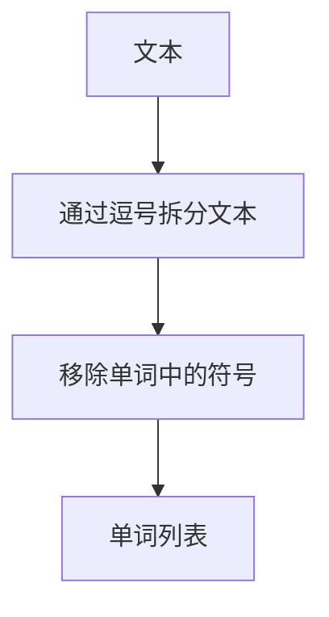

# my small demo.
## 功能
1. 接收文本，解析文本，放回解析结果
## 功能分析
1. 接收文本，解析文本，返回其中的单词。
文本为英文段落，结果为英文段落中的单词。
## 功能实现思路
1. 对单词的提取，在英文段落中单词间使用空格分隔，在段落中可能会出现逗号，句点等符号，这些符号可能会出现在单词的前或后的位置。
流程：

```mermaid
graph TD;
文本-->A[通过逗号拆分文本];
A-->B[移除单词中的符号];
B --> 单词列表;
```
